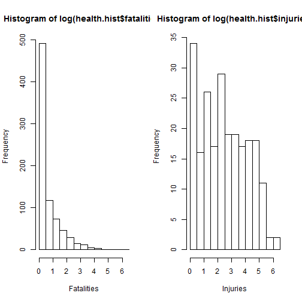
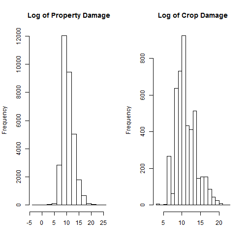

Human and Economic Costs of Weather Events: A United States View
========================================================
The purpose of this analysis is to measure the costs human life and ecomonic costs of significant weather events.  The data for this analysis comes from the NOAA storm database, with measured storm characteristics across the United States, from 1950 - 2011.  This report will use a raw data file, perform the necessary conversions for any subsequent analysis, and present the results.  
## Data Processing 

First we must download the necessary data and reduce it's size.  The initial data, once decompressed contains 902,297 observations  of individual storms with 37 characteristic variables. 

```r
setwd("C:/coursera/RepData_PeerAssessment2")
# retrieving the data
if(!file.exists("NOAA.csv.bz2")){
url <- "https://d396qusza40orc.cloudfront.net/repdata%2Fdata%2FStormData.csv.bz2"
download.file(url, "NOAA.csv.bz2")}

#load data, and decompress
data <- read.csv(bzfile("NOAA.csv.bz2"))
name <- c("BGN_DATE", "STATE", "EVTYPE", "FATALITIES", 
          "INJURIES", "PROPDMG", "PROPDMGEXP", "CROPDMG", "CROPDMGEXP")
data <- data[,(names(data) %in% name)]
names(data) <- tolower(names(data))
```

Next, the data needs to be processed appropriately. First looking at the economic impact variables, property and crop damage are described by two variables each, first a numeric component and second a magnitude as thousands (k), millions (m), and billions (b).  The following code chunk combines these two into one dollar figure.  

```r
#Adjusting property and crop damage costs into appropriate numeric values
# Property damage
data$propdmg[as.character(data$propdmgexp) %in% c("k", "K")] <- 
        data$propdmg[as.character(data$propdmgexp) %in% c("k", "K")] * 1000
data$propdmg[as.character(data$propdmgexp) %in% c("m", "M")] <- 
        data$propdmg[as.character(data$propdmgexp) %in% c("m", "M")] * 1000000
data$propdmg[as.character(data$propdmgexp) %in% c("b", "B")] <- 
        data$propdmg[as.character(data$propdmgexp) %in% c("b", "B")] * 1000000000
# Crop damage
data$cropdmg[as.character(data$cropdmgexp) %in% c("k", "K")] <- 
        data$cropdmg[as.character(data$cropdmgexp) %in% c("k", "K")] * 1000
data$cropdmg[as.character(data$cropdmgexp) %in% c("m", "M")] <- 
        data$cropdmg[as.character(data$cropdmgexp) %in% c("m", "M")] * 1000000
data$cropdmg[as.character(data$cropdmgexp) %in% c("b", "B")] <- 
        data$cropdmg[as.character(data$cropdmgexp) %in% c("b", "B")] * 1000000000
```
Next the events are described in a messy fashion, with misspelled and both lower and upper case factor levels.  We attempt to consolidate redundent levels in the next code chunk, and for the sake of brevity, any events that describe multiple events, the first description is used.  

The following process eliminates some level of detail, but it will improve precision by collapsing many closely related groups into individual factor units.  This will help to provide a more general picutre of the overall costs of different events, and once this is determined one can go back and drill into the details of any individual event.  This lowers the factor levels from over 900 to 400 different factor levels, and will assist in simplifying general results


```r
data$evtype <- tolower(data$evtype)
tempSep <- strsplit(data$evtype, "[/;,.-\\]")

#function to use the first discriptor before seperator
first.elm <- function(x){x[1]} #simple extractor function
data$evtype <- unlist(sapply(tempSep, first.elm))

#the and seperator, and dropping any trailing and
andSep <- strsplit(data$evtype, "( and | & )")
data$evtype <- unlist(sapply(andSep, first.elm))
data$evtype <- gsub(" [Aa][Nn][Dd]$", "", data$evtype )

#eliminate trailing numbers, for simplification of evaluation
data$evtype <- gsub("[0-9]*$", "", data$evtype) #trailing numbers
data$evtype <- gsub(" .g[0-9]*.$", "", data$evtype) #MPH numbers

#errant puncuation and letters
data$evtype <- gsub(" \\(.*$", "", data$evtype) #for parenthesis with char
data$evtype <- gsub("\\($", "", data$evtype) #for parenthesis at end
data$evtype <- gsub("-", " ", data$evtype)
data$evtype <- gsub(" +[A-Za-z] +", "", data$evtype) #middle single letters
data$evtype <- gsub(" +[A-Za-z]$", "", data$evtype) #trailing single letters

#consolidating pluarl and erronous descriptors
data$evtype <- gsub("ss$", "s", data$evtype) #double plural s i.e. ...ss
data$evtype <- gsub("drynes" ,"dry" , data$evtype)        
data$evtype <- gsub("wetnes(s?)" ,"wet" , data$evtype)
data$evtype <- gsub("ies$", "y", data$evtype)
data$evtype <- gsub("floes", "flow", data$evtype)
data$evtype <- gsub("oes", "o", data$evtype)
data$evtype <- gsub("s$", "", data$evtype) #to eliminate remaining plurality

#abbreviations
data$evtype <- gsub("tstm", "thunder storm", data$evtype)
data$evtype <- gsub("hvy", "heavy", data$evtype)
data$evtype <- gsub("wnd", "wind", data$evtype)
data$evtype <- gsub("hvy", "heavy", data$evtype)
data$evtype <- gsub("sml", "small", data$evtype)
data$evtype <- gsub("fld", "flood", data$evtype)
data$evtype <- gsub("precip$", "precipitation", data$evtype )

#lots of storm misspelling
data$evtype <- gsub("storm", " storm", data$evtype)
data$evtype <- gsub("storm[ws]", "storm", data$evtype)
data$evtype <- gsub("thundertorm", "thunder storm", data$evtype)
data$evtype <- gsub("thundestorm", "thunder storm", data$evtype)
data$evtype <- gsub("thunerstorm", "thunder storm", data$evtype)
data$evtype <- gsub("tunderstorm", "thunder storm", data$evtype)
data$evtype <- gsub("thuder", "thunder", data$evtype)
data$evtype <- gsub("thundeer", "thunder", data$evtype)
data$evtype <- gsub(" win$", " wind", data$evtype)
data$evtype <- gsub("stormind", "storm wind", data$evtype)
data$evtype <- gsub("thuner", "thunder", data$evtype)
data$evtype <- gsub("thundere", "thunder", data$evtype)
data$evtype <- gsub("winds", "wind", data$evtype)
data$evtype <- gsub("windhail", "wind hail", data$evtype)
data$evtype <- gsub("sorm", "storm", data$evtype)
data$evtype <- gsub("strom", "Storm", data$evtype)

#date summaries, consolodated into one factor
data$evtype <- gsub("^summary .+$", "summary", data$evtype)

#correcting for idiosyncracies in the descriptors
data$evtype <- gsub("chill .*$" , "chill" , data$evtype) #chill and chill temperatures appears 
data$evtype <- gsub("snow-.*$" , "snow" , data$evtype)
data$evtype <- gsub("drynes" ,"dry" , data$evtype)        
data$evtype <- gsub("wetnes(s?)" ,"wet" , data$evtype)
data$evtype <- gsub("avalance" ,"avalanche" , data$evtype)  
data$evtype <- gsub("erosin", "erosion", data$evtype)
data$evtype <- gsub("coastal^ ", "coastal ", data$evtype)
data$evtype <- gsub("cstl", "coastal", data$evtype)
data$evtype <- gsub("mirco", "micro", data$evtype)
data$evtype <- gsub("devel", "devil", data$evtype)
data$evtype <- gsub("ooo", "oo", data$evtype)
data$evtype <- gsub("flood flood", "flood", data$evtype)
data$evtype <- gsub("flooding", "flood", data$evtype)
data$evtype <- gsub("precipatation", "precipitation", data$evtype)
data$evtype <- gsub("andblowing.*$", "", data$evtype)
data$evtype <- gsub("lighting", "lightning", data$evtype)
data$evtype <- gsub("w ind", "wind", data$evtype)
data$evtype <- gsub("debri", "debris", data$evtype)
data$evtype <- gsub("able", "ably", data$evtype)
data$evtype <- gsub("unseasonal", "unseasonably", data$evtype)
data$evtype <- gsub("unusual", "unusually", data$evtype)
data$evtype <- gsub("vog", "fog", data$evtype)
data$evtype <- gsub("spout", " spout", data$evtype)
data$evtype <- gsub("fire", " fire", data$evtype)
data$evtype <- gsub("flood", " flood", data$evtype)

#eliminate double spaces and white space
data$evtype <- gsub(" +( *)", " ", data$evtype) #double or multiple space
data$evtype <- gsub("^( *)", "", data$evtype) #left white space
data$evtype <- gsub("( *)$", "", data$evtype) #right white space

#tropical storm and hurricane names
data$evtype <- gsub("hurricane .*$", "hurricane", data$evtype)
data$evtype <- gsub("tropical storm .*$", "tropical storm", data$evtype)

levels <- levels(as.factor(data$evtype))
levels <- data.frame(levels, grepl(".(s|es)$", levels))
#
```
## Results
Now that we have parsed the data and cleaned it to contain the appropriate variables, lets conduct some analysis.  The code chunk below presents some summary statistics for the top ten costliest events for each of the four variables.  


```r
require(doBy)
```

```
## Loading required package: doBy
## Loading required package: survival
## Loading required package: splines
## Loading required package: MASS
```

```r
#average costs
agg.mean <- summaryBy(fatalities + injuries + propdmg + cropdmg ~ evtype, 
                 data = data, FUN = mean)
#for fatalities
agg.mean <- agg.mean[order(agg.mean$fatalities.mean, decreasing = TRUE),] 
agg.mean[1:10, c(1,2)]
```

```
##                evtype fatalities.mean
## 79       extreme heat           4.364
## 246            record           4.250
## 124 heat wave drought           4.000
## 207     marine mishap           3.500
## 277         rough sea           2.667
## 123         heat wave           2.299
## 343           tsunami           1.650
## 132         heavy sea           1.500
## 34       cold weather           1.250
## 121              heat           1.220
```

```r
#for injuries
agg.mean <- agg.mean[order(agg.mean$injuries.mean, decreasing = TRUE),] 
agg.mean[1:10, c(1,3)]
```

```
##                     evtype injuries.mean
## 124      heat wave drought        15.000
## 396 winter storm high wind        15.000
## 398     winter weather mix        11.333
## 79            extreme heat         7.045
## 231 non severe wind damage         7.000
## 343                tsunami         6.450
## 72      excessive rainfall         5.250
## 105                  glaze         5.250
## 123              heat wave         4.922
## 161              hurricane         4.611
```

```r
#property damage
agg.mean <- agg.mean[order(agg.mean$propdmg.mean, decreasing = TRUE),] 
agg.mean[1:10, c(1,4)]
```

```
##                     evtype propdmg.mean
## 161              hurricane    294292292
## 308            storm surge    117273164
## 396 winter storm high wind     60000000
## 345                typhoon     54566364
## 118             hail storm     48200000
## 203            major flood     35000000
## 284   severe thunder storm     33537778
## 273            river flood     25917027
## 342         tropical storm     11067992
## 66                 erosion      8100000
```

```r
#crop damage
agg.mean <- agg.mean[order(agg.mean$cropdmg.mean, decreasing = TRUE),] 
agg.mean[1:10, c(1,5)]
```

```
##                        evtype cropdmg.mean
## 74              excessive wet    142000000
## 40            damaging freeze     37028750
## 273               river flood     25037050
## 62                early frost     21000000
## 161                 hurricane     19150322
## 96                     freeze      6009539
## 285 severe thunder storm wind      5800000
## 48                    drought      5586794
## 396    winter storm high wind      5000000
## 36                       cool      5000000
```

```r
#Median costs
agg.median <- summaryBy(fatalities + injuries + propdmg + cropdmg ~ evtype, 
                 data = data, FUN = median )
#for fatalities
agg.median <- agg.median[order(agg.median$fatalities.median, decreasing = TRUE),] 
agg.median[1:10, c(1,2)]
```

```
##                evtype fatalities.median
## 124 heat wave drought               4.0
## 207     marine mishap               3.5
## 277         rough sea               2.0
## 132         heavy sea               1.5
## 34       cold weather               1.0
## 49           drowning               1.0
## 76      extended cold               1.0
## 101    freezing spray               1.0
## 144          high sea               1.0
## 162      hyperthermia               1.0
```

```r
#for injuries
agg.median <- agg.median[order(agg.median$injuries.median, decreasing = TRUE),] 
agg.median[1:10, c(1,3)]
```

```
##                     evtype injuries.median
## 124      heat wave drought            15.0
## 396 winter storm high wind            15.0
## 231 non severe wind damage             7.0
## 340    torrential rainfall             4.0
## 207          marine mishap             2.5
## 204        marine accident             2.0
## 136      heavy snow shower             2.0
## 275             rogue wave             2.0
## 374           warm weather             2.0
## 331            thundersnow             1.0
```

```r
#property damage
agg.median <- agg.median[order(agg.median$propdmg.median, decreasing = TRUE),] 
agg.median[1:10, c(1,4)]
```

```
##                     evtype propdmg.median
## 396 winter storm high wind       60000000
## 203            major flood       50000000
## 66                 erosion        8100000
## 155   high wind heavy rain        7500000
## 95             forest fire        5000000
## 138         heavy snowpack        5000000
## 192         lightning fire        5000000
## 118             hail storm        1000000
## 161              hurricane        1000000
## 25         coastal erosion         766000
```

```r
#crop damage
agg.median <- agg.median[order(agg.median$cropdmg.median, decreasing = TRUE),] 
agg.median[1:10, c(1,5)]
```

```
##                     evtype cropdmg.median
## 74           excessive wet       1.42e+08
## 62             early frost       2.10e+07
## 396 winter storm high wind       5.00e+06
## 36                    cool       5.00e+06
## 351      unseasonably rain       5.00e+06
## 5      agricultural freeze       7.40e+05
## 95             forest fire       5.00e+05
## 124      heat wave drought       5.00e+04
## 319     thunder storm hail       5.00e+04
## 40         damaging freeze       4.00e+04
```

```r
#aggregated total costs
agg.sum <- summaryBy(fatalities + injuries + propdmg + cropdmg ~ evtype, 
                 data = data, FUN = sum )
#for fatalities
agg.sum <- agg.sum[order(agg.sum$fatalities.sum, decreasing = TRUE),] 
agg.sum[1:10, c(1,2)]
```

```
##                 evtype fatalities.sum
## 336            tornado           5658
## 69      excessive heat           1903
## 86         flash flood           1018
## 121               heat            937
## 190          lightning            817
## 321 thunder storm wind            710
## 270        rip current            577
## 91               flood            495
## 152          high wind            293
## 78        extreme cold            287
```

```r
#for injuries
agg.sum <- agg.sum[order(agg.sum$injuries.sum, decreasing = TRUE),] 
agg.sum[1:10, c(1,3)]
```

```
##                 evtype injuries.sum
## 336            tornado        91364
## 321 thunder storm wind         9469
## 91               flood         6806
## 69      excessive heat         6525
## 190          lightning         5231
## 121               heat         2100
## 172          ice storm         1977
## 86         flash flood         1785
## 152          high wind         1471
## 114               hail         1361
```

```r
#property damage
agg.sum <- agg.sum[order(agg.sum$propdmg.sum, decreasing = TRUE),] 
agg.sum[1:10, c(1,4)]
```

```
##                 evtype propdmg.sum
## 91               flood   1.450e+11
## 161          hurricane   8.476e+10
## 336            tornado   5.854e+10
## 308        storm surge   4.796e+10
## 86         flash flood   1.673e+10
## 114               hail   1.573e+10
## 321 thunder storm wind   9.761e+09
## 342     tropical storm   7.714e+09
## 395       winter storm   6.689e+09
## 152          high wind   5.995e+09
```

```r
#crop damage
agg.sum <- agg.sum[order(agg.sum$cropdmg.sum, decreasing = TRUE),] 
agg.sum[1:10, c(1,5)]
```

```
##                 evtype cropdmg.sum
## 48             drought   1.397e+10
## 91               flood   5.879e+09
## 161          hurricane   5.515e+09
## 273        river flood   5.057e+09
## 172          ice storm   5.022e+09
## 114               hail   3.026e+09
## 86         flash flood   1.437e+09
## 78        extreme cold   1.313e+09
## 321 thunder storm wind   1.224e+09
## 102              frost   1.160e+09
```
### Population Health Impacts
Looking at the human life impact statistics, the notabile results is that typically the most dangerous events are the result of either hard to predict or typically unexpected weather events, or more day to day weather events.  These include maritime accidents and tsunami's.  
Also notable is the fact that extreme heat and heatwaves seem to be relatively dangerous to population health.  The highest mean and median numbers for fatalities and injuries caused by weather events are heat related, and furthermore, the summed number deaths and injuries appears as in the top 4 most dangerous events as well.  This may be due to the lack of proper education of how to deal with heat, and how relatively easy it is to get sick in even moderate heat.  
To look at this closer, see a histogram of the heat events:

```r
health.hist <- data[grep("heat", data$evtype), 
                    c("evtype", "fatalities", "injuries")]

par(mfrow = c(1,2))
hist(log(health.hist$fatalities), xlab = "Fatalities")
hist(log(health.hist$injuries), xlab = "Injuries")
```

 
From this picture, after log transformation of the variables to aid in visual inspection, deaths related to any one heat related event are typically low, and individuals are much more likely to sustain injuries than death.

### Economic Impacts
The economic front shows a more intuitive picture of what one would expect.  Costly events are for property damage are typically large storms, such as hurricanes, typhoons, floods and fire.  For crop damage the events that seem to drive costs are related to freezing conditions, hot conditions, or dry conditions.  To visualize this, lets consider some histograms.


```r
#selecting top contributing events
econ.prop.hist <- data[grep("(hurricane|tropical|typhoon|flood)",data$evtype),
                       c("evtype", "propdmg")]
econ.crop.hist <- data[grep("(freez|heat|flood|drought|frost|cold|wet)", 
                            data$evtype), c("evtype", "cropdmg")]
par(mfrow = c(1,2))
hist(log(econ.prop.hist$propdmg), main = "Log of Property Damage",
     xlab = "")
hist(log(econ.crop.hist$cropdmg), main = "Log of Crop Damage", 
     xlab = "")
```

 

```r
#for frame of reference, exponentiating 
exp(5);exp(10); exp(15)
```

```
## [1] 148.4
```

```
## [1] 22026
```

```
## [1] 3269017
```
Here the distribution of costs is much less skewed than the health related events previously described.  Many of these events are hard to plan for, and hard to avoid.  
